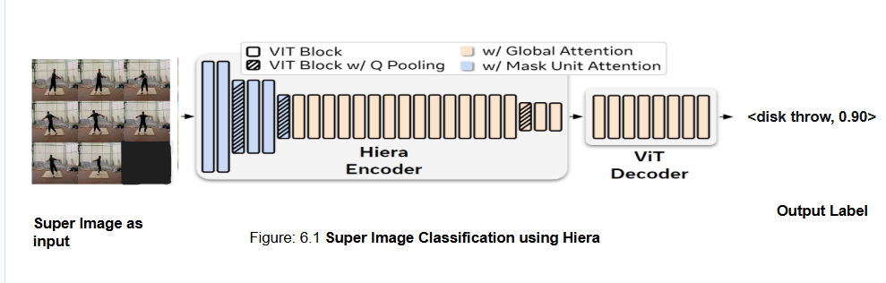
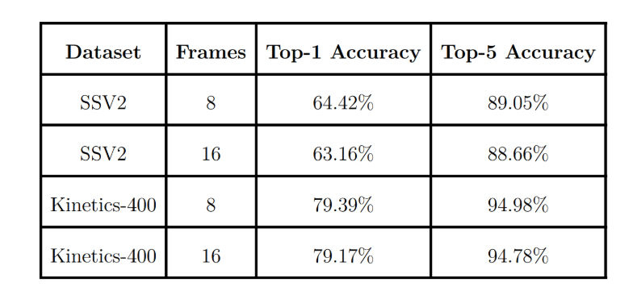

# SIFAR-Hiera: Super Image for Action Recognition using Hiera

This repository presents a framework for **video action recognition** using **Super Image (SIFAR) representations** with **Hierarchical Vision Transformers (Hiera)** as the backbone.

The goal is to enable efficient spatiotemporal learning by leveraging image-based architectures for video understanding.

---

##  Overview

**SIFAR (Super Image for Action Recognition)** converts a sequence of video frames into a single structured image by arranging frames into a spatial grid.

This removes the need for explicit temporal modeling and allows direct use of powerful image backbones.

In this work, we integrate **Hiera (Hierarchical Vision Transformer)**:

- Captures **multi-scale spatial hierarchies**
- Efficient compared to standard Vision Transformers
- Well-suited for Super Image representations

---

##  Architecture

<p align="center">
  
  <br>
  <em>Figure 1: SIFAR-Hiera pipeline for action recognition</em>
</p>

**Pipeline Overview:**

```

Video Frames
│
▼
Frame Sampling
│
▼
Super Image Construction (SIFAR)
│
▼
Hiera Backbone (Small / Base)
│
▼
Classification Head
│
▼
Action Prediction

````

---

##  Results

<p align="center">
  
  <br>
  <em>Table 1: Performance comparison across different configurations</em>
</p>

---

## Super Image Configurations

| Configuration | Grid Size | Frames | super_img_rows |
|--------------|----------|--------|----------------|
| **4×4 SIFAR** | 4 × 4    | 16     | 4              |
| **3×3 SIFAR** | 3 × 3    | 8      | 3              |

---

##  Quick Start

### 1. Clone Repository

```bash
git clone https://github.com/Rik-Sarkar-07/SIFAR-HIERA.git
cd SIFAR-HIERA
````

---

### 2. Environment Setup

```bash
conda env create --file env.yaml
conda activate sifar_msn
```

---

##  Dataset Preparation

Supported datasets:

* **Kinetics-400**
* **Something-Something-v2 (SSv2)**
* **UCF101**
* **HMDB51**

### Annotation Format

```
/path/to/video.mp4 label start_frame end_frame
```

---

##  Training (Kinetics-400)

###  Hiera Base – 4×4 Super Image (16 Frames)

```bash
CUDA_VISIBLE_DEVICES=0 python -m torch.distributed.launch --nproc_per_node=1 --master_port=28528 main.py \
  --data_dir /path/to/Kinetics400 \
  --use_pyav --dataset kinetics400 \
  --opt adamw --lr 1e-4 --epochs 30 --sched cosine \
  --duration 16 --batch-size 4 --super_img_rows 4 \
  --num_workers 16 --disable_scaleup \
  --mixup 0.8 --cutmix 1.0 --drop-path 0.05 \
  --pretrained --warmup-epochs 5 --no-amp \
  --model hiera_base \
  --output_dir /path/to/output \
  --weight-decay 0.01 --clip-grad 2.0 \
  --class_numbers 400
```

---

###  Hiera Small – 4×4 Super Image (16 Frames)

```bash
CUDA_VISIBLE_DEVICES=0 python -m torch.distributed.launch --nproc_per_node=1 --master_port=28527 main.py \
  --data_dir /path/to/Kinetics400 \
  --use_pyav --dataset kinetics400 \
  --opt adamw --lr 1e-4 --epochs 30 --sched cosine \
  --duration 16 --batch-size 4 --super_img_rows 4 \
  --num_workers 16 --disable_scaleup \
  --mixup 0.8 --cutmix 1.0 --drop-path 0.05 \
  --pretrained --warmup-epochs 5 --no-amp \
  --model hiera_small \
  --output_dir /path/to/output \
  --weight-decay 0.01 --clip-grad 2.0 \
  --class_numbers 400
```

---

###  Hiera Base – 3×3 Super Image (8 Frames)

```bash
CUDA_VISIBLE_DEVICES=0 python -m torch.distributed.launch --nproc_per_node=1 --master_port=28526 main.py \
  --data_dir /path/to/Kinetics400 \
  --use_pyav --dataset kinetics400 \
  --opt adamw --lr 1e-4 --epochs 30 --sched cosine \
  --duration 8 --batch-size 4 --super_img_rows 3 \
  --num_workers 16 --disable_scaleup \
  --mixup 0.8 --cutmix 1.0 --drop-path 0.05 \
  --pretrained --warmup-epochs 5 --no-amp \
  --model hiera_base \
  --output_dir /path/to/output \
  --weight-decay 0.01 --clip-grad 2.0 \
  --class_numbers 400
```

---

##  Key Features

*  Efficient video understanding via image-based modeling
*  Super Image (SIFAR) representation
*  Hiera Small & Base backbones
*  Multiple dataset support
*  Clean and scalable training pipeline

---

## Project Structure

```
SIFAR-HIERA/
│── assets/
│   ├── Arch.png
│   ├── Table.png
│
│── main.py
│── video_dataset_config.py
│── env.yaml
```

---

##  Acknowledgements

This work builds upon:

* **SIFAR: Super Image for Action Recognition**
* **Hiera: Hierarchical Vision Transformer**

---

## Contact

**Author:** Sudipta Sarkar  

**Date:** March 2026  

**Email:** [sudiptasarkar3600@gmail.com](mailto:sudiptasarkar3600@gmail.com)  

**Website:** [https://my-website  ](https://sudipta-rkmrc.github.io/website/)

---
